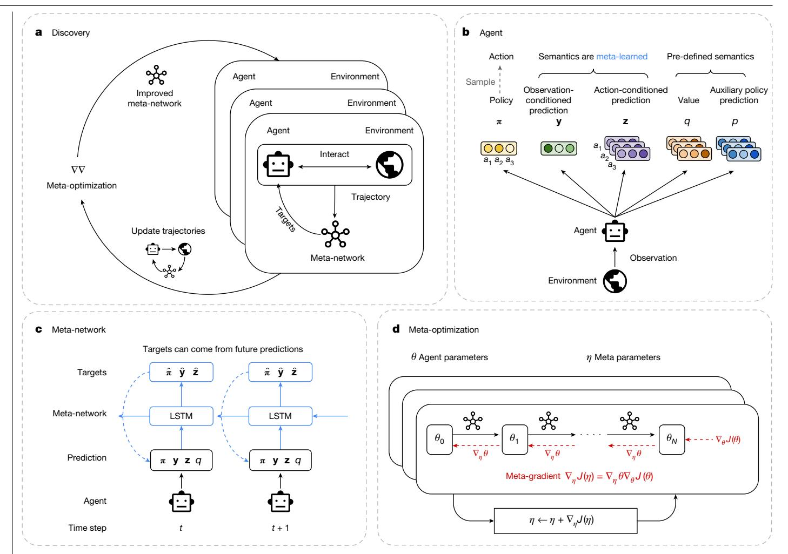
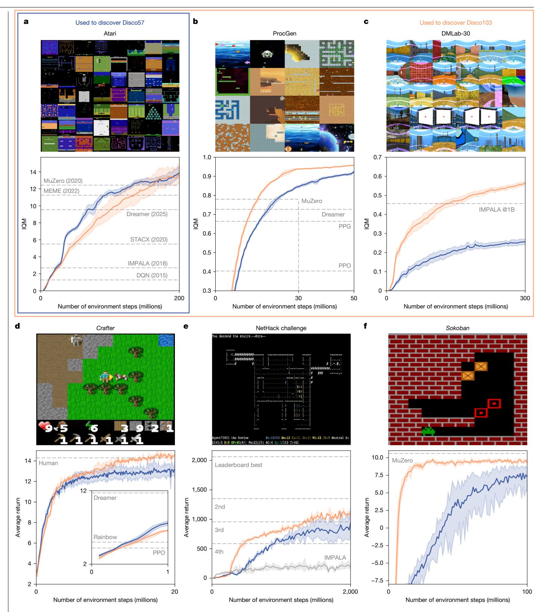
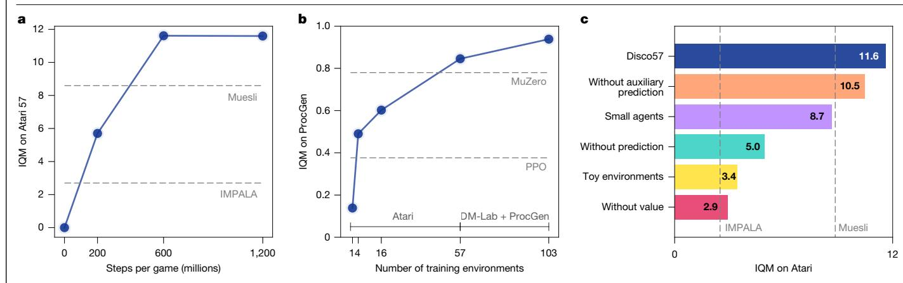
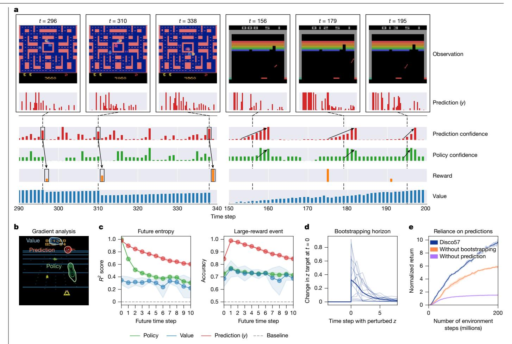
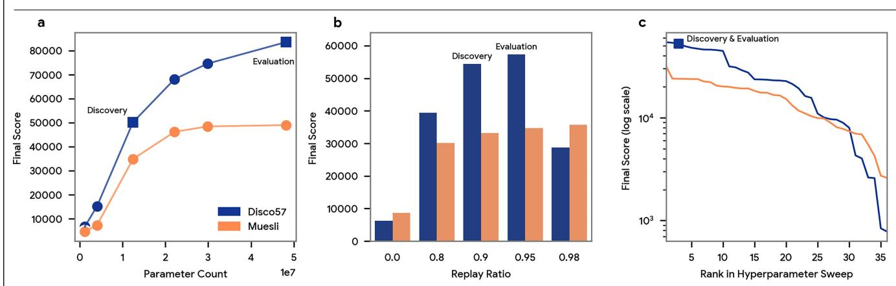
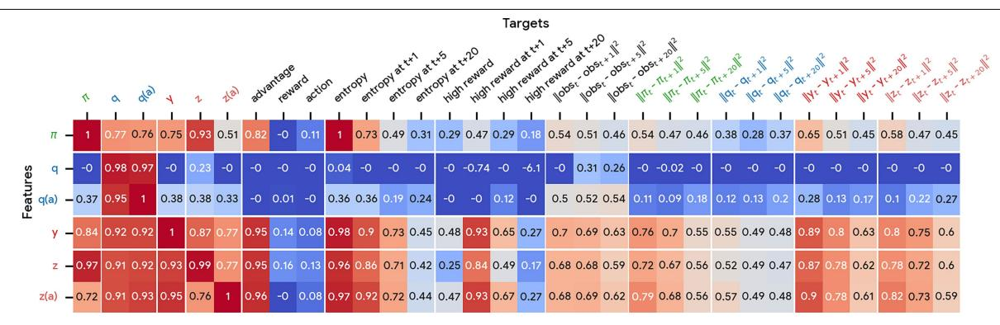
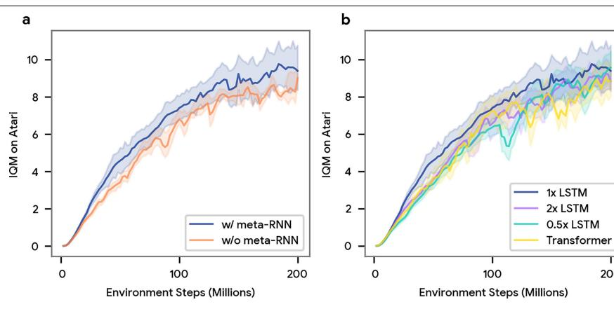
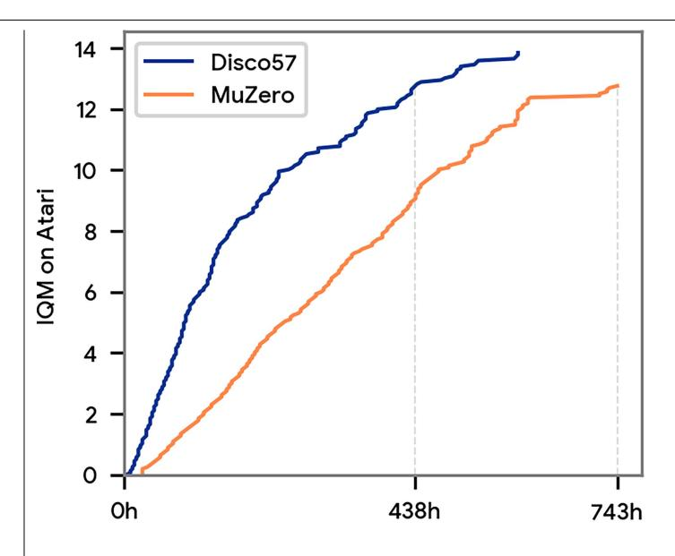

# Discovering state-of-the-art reinforcement learning algorithms

https://doi.org/10.1038/s41586-025-09761-x

Received: 11 December 2024

Accepted: 15 October 2025

Published online: 22 October 2025

Open access

Junhyuk Oh1,2™, Gregory Farguhar1,2, Jurii Kemaev1,2, Dan A. Calian1,2, Matteo Hessel1, Luisa Zintgraf¹, Satinder Singh¹, Hado van Hasselt¹ & David Silver¹ ⊠

Humans and other animals use powerful reinforcement learning (RL) mechanisms that have been discovered by evolution over many generations of trial and error. By contrast, artificial agents typically learn using handcrafted learning rules. Despite decades of interest, the goal of autonomously discovering powerful RL algorithms has proven to be elusive1-6. Here we show that it is possible for machines to discover a state-of-the-art RL rule that outperforms manually designed rules. This was achieved by meta-learning from the cumulative experiences of a population of agents across a large number of complex environments. Specifically, our method discovers the RL rule by which the agent's policy and predictions are updated. In our large-scale experiments, the discovered rule surpassed all existing rules on the well-established Atari benchmark and outperformed a number of state-of-the-art RL algorithms on challenging benchmarks that it had not seen during discovery. Our findings suggest that the RL algorithms required for advanced artificial intelligence may soon be automatically discovered from the experiences of agents, rather than manually designed.

The primary goal of artificial intelligence is to design agents that, like humans, can predict and act in complex environments to achieve goals. Many of the most successful agents are based on reinforcement learning (RL), in which agents learn by interacting with environments. Decades of research have produced ever more efficient RL algorithms, resulting in numerous landmarks in artificial intelligence, including the mastery of complex competitive games such as Go7, chess8, StarCraft9 and *Minecraft*10, the invention of new mathematical tools11, or the control of complex physical systems12.

Unlike humans, whose learning mechanism has been naturally discovered by biological evolution, RL algorithms are typically manually designed. This is usually slow and laborious, and limited by reliance on human knowledge and intuition. Although a number of attempts have been made to automatically discover learning algorithms1-6, none have proven to be sufficiently efficient and general to replace hand-designed RL systems.

In this work, we introduce an autonomous method for discovering RL rules solely through the experience of many generations of agents interacting with various environments (Fig. 1a). The discovered RL rule achieves state-of-the-art performance on a variety of challenging RL benchmarks. The success of our method contrasts previous work in two dimensions. First, whereas previous methods searched over narrow spaces of RL rules (for example, hyperparameters13,14 or policy loss1,6), our method allows the agent to explore a far more expressive  $space \, of \, potential \, RL \, rules. \, Second, \, whereas \, previous \, work \, focused \, on \,$ meta-learning in simple environments (for example, grid-worlds3,15), our method meta-learns in complex and diverse environments at a much larger scale.

To choose a general space of discovery, we observe that the essential component of standard RL algorithms is a rule that updates one or more predictions, as well as the policy itself, towards targets that are functions of quantities such as future rewards and future predictions. Examples of RL rules based on different targets include temporal-difference learning16, Q-learning17, proximal policy optimization (PPO)18, auxiliary tasks19, successor features20 and distributional RL21. In each case, the choice of target determines the nature of the predictions, for example, whether they become value functions, models or successor features.

In our framework, an RL rule is represented by a meta-network that determines the targets towards which the agent should move its predictions and policy (Fig. 1c). This allows the system to discover useful predictions without pre-defined semantics, as well as how they are used. The system may in principle rediscover past RL rules, but the flexible functional form also allows the agent to invent new RL rules that may be specifically adapted to environments of interest.

During the discovery process, we instantiate a population of agents, each of which interacts with its own instance of an environment taken from a diverse set of challenging tasks. Each agent's parameters are updated according to the current RL rule. We then use the meta-gradient method13 to incrementally improve the RL rule such that it could lead to better-performing agents.

Our large-scale empirical results show that our discovered RL rule, which we call DiscoRL, surpasses all existing RL rules on the environments in which it was meta-learned. Notably, this includes Atari games22, arguably the most established and informative of RL benchmarks. Furthermore, DiscoRL achieved state-of-the-art performance on a number of other challenging benchmarks, such as ProcGen23, that it had never been exposed to during discovery. We also show that the performance and generality of DiscoRL improves further as more diverse and complex environments are used in discovery. Finally, our analysis shows that DiscoRL has discovered unique prediction semantics that

1Google DeepMind, London, UK. 2These authors contributed equally: Junhyuk Oh, Gregory Farquhar, Iurii Kemaev, Dan A. Calian. ™e-mail: junhyuk@google.com; davidsilver@google.com

Fig. 1 | Discovering an RL rule from a population of agents. a, Discovery. Multiple agents, interacting with various environments, are trained in parallel according to the learning rule, defined by the meta-network. In the meantime, the meta-network is optimized to improve the agents' collective performances. **b**, Agent architecture. An agent produces the following outputs: (1) a policy  $(\pi)$ , (2) an observation-conditioned prediction vector (y), (3) action-conditioned prediction vectors  $(\mathbf{z})$ , (4) action values  $(\mathbf{q})$  and (5) an auxiliary policy prediction  $(\mathbf{p})$ . The semantics of y and z are determined by the meta-network. c, Meta-network architecture. A trajectory of the agent's outputs is given as input to the

meta-network, together with rewards and episode termination indicators from the environment (omitted for simplicity in the figure). Using this information, the meta-network produces targets for all of the agent's predictions from the current and future time steps. The agent is updated to minimize the prediction errors with respect to their targets. LSTM, long short-term memory. d, Metaoptimization. The meta-parameters of the meta-network are updated by taking a meta-gradient step calculated from backpropagation through the agent's update process ( $\theta_0 \rightarrow \theta_N$ ), where the meta-objective is to maximize the collective returns of the agents in their environments.

are distinct from existing RL concepts such as value functions. To the best of our knowledge, this is the empirical evidence that surpassing manually designed RL algorithms in terms of both generality and efficiency is finally within reach.

#### **Discovery method**

Our discovery approach involves two types of optimization: agent optimization and meta-optimization. Agent parameters are optimized by updating their policies and predictions towards the targets produced by the RL rule. Meanwhile, the meta-parameters of the RL rule are optimized by updating its targets to maximize the cumulative rewards of the agents.

### Agent network

Much RL research considers what predictions an agent should make (for example, values), and what loss function should be used to learn those predictions (for example, temporal-difference (TD) learning) and improve the policy (for example, policy gradient). Instead of hand-crafting them, we define an expressive space of predictions without pre-defined semantics and meta-learn what the agent needs to optimize by representing it using a meta-network. It is desirable to maintain the ability to represent key ideas in existing RL algorithms, while supporting a large space of novel algorithmic possibilities.

To this end, we let the agent, parameterized by  $\theta$ , output two types of predictions in addition to a policy  $(\pi)$ : an observation-conditioned vector prediction  $\mathbf{y}(s) \in \mathbb{R}^n$  of arbitrary size n and an action-conditioned vector prediction  $\mathbf{z}(s, a) \in \mathbb{R}^m$  of arbitrary size m, where s and a are an observation and an action, respectively (Fig. 1b). The form of these predictions stems from the fundamental distinction between prediction and control16. For example, value functions are commonly divided into state-value functions v(s) (for prediction) and actionvalue functions  $\mathbf{q}(s, a)$  (for control), and many other concepts in RL, such as rewards and successor features, also have an observationconditioned version and an action-conditioned version. Therefore, the functional form of the predictions (y, z) is general enough to represent, but is not restricted to, many existing fundamental concepts in RL.

In addition to the predictions to be discovered, in most of our experiments the agent makes predictions with pre-defined semantics. Specifically, the agent produces an action-value function  $\mathbf{q}(s, a)$  and an action-conditional auxiliary policy prediction  $\mathbf{p}(s, a)^8$ . This encourages the discovery process to focus on discovering new concepts through y and z.

#### Meta-network

A large proportion of modern RL rules use the forward view of RL16. In this view, the RL rule receives a trajectory from time step t to t + n, and uses this information to update the agent's predictions or policy. They typically update the predictions or policy towards bootstrapped targets, that is, towards future predictions.

Correspondingly, our RL rule uses a meta-network (Fig. 1c) as a function that determines targets towards which the agent should move its predictions and policy. To produce targets at time step t, the meta-network receives as input a trajectory of the agent's predictions and policy as well as rewards and episode termination from time step t to t + n. It uses a standard long short-term memory24 to process these inputs, although other architectures may be used (Extended

The choice of inputs and outputs to the meta-network maintains certain desirable properties of handcrafted RL rules. First, the metanetwork can deal with any observation and with discrete action spaces of any size. This is possible because the meta-network does not receive the observation directly as input, but only indirectly via predictions. In addition, it processes action-specific inputs and outputs by sharing weights across action dimensions. As a result it can generalize to radically different environments. Second, the meta-network is agnostic to the design of the agent network, as it sees only the output of the agent network. As long as the agent network produces the required form of outputs  $(\pi, y, z)$ , the discovered RL rule can generalize to arbitrary agent architectures or sizes. Third, the search space defined by the meta-network includes the important algorithmic idea of bootstrapping. Fourth, as the meta-network processes both policy and predictions together, it can not only meta-learn auxiliary tasks25 but also directly use predictions to update the policy (for example, to provide a baseline for variance reduction). Finally, outputting targets is strictly more expressive than outputting a scalar loss function, as it includes semi-gradient methods such as Q-learning in the search space. While building on these properties of standard RL algorithms, the rich parametric neural network allows the discovered rule to implement algorithms with potentially much greater efficiency and contextual nuance.

#### **Agent optimization**

The agent's parameters ( $\theta$ ) are updated to minimize the distance from its predictions and policy to the targets from the meta-network. The agent's loss function can be expressed as:

$$L(\theta) = \mathbb{E}_{s,a \sim \boldsymbol{\pi}_{\theta}} [D(\boldsymbol{\hat{\pi}}, \boldsymbol{\pi}_{\theta}(s)) + D(\boldsymbol{\hat{y}}, \boldsymbol{y}_{\theta}(s)) + D(\boldsymbol{\hat{z}}, \boldsymbol{z}_{\theta}(s, a)) + L_{\text{aux}}]$$

where s and a are distributed according to the policy  $\pi_{\theta}$ , and  $D(\mathbf{p}, \mathbf{q})$ is a distance function between **p** and **q**. We chose the Kullback–Leibler divergence as the distance function, as it is sufficiently general and has previously been found to make meta-optimization easier3. Here  $\pi_{\theta}$ ,  $\mathbf{y}_{\theta}$ ,  $\mathbf{z}_{\theta}$  and  $\hat{\mathbf{\pi}}$ ,  $\hat{\mathbf{y}}$ ,  $\hat{\mathbf{z}}$  are the outputs of the agent network and the meta-network, respectively, with a softmax function applied to normalize each vector.

The auxiliary loss  $L_{\text{aux}}$  is used for predictions with pre-defined semantics: action values (**q**) and auxiliary policy predictions (**p**) as follows:  $L_{\text{aux}} = D(\mathbf{\hat{q}}, \mathbf{q}_{\theta}(s, a)) + D(\mathbf{\hat{p}}, \mathbf{p}_{\theta}(s, a))$ , where  $\mathbf{\hat{q}}$  is an action-value target from Retrace26 projected to a two-hot vector8, and  $\hat{\mathbf{p}} = \mathbf{\pi}_{\theta}(s')$  is the policy at the one-step future state. To be consistent with the rest of losses, we use the Kullback–Leibler divergence as the distance function *D*.

#### **Meta-optimization**

Our goal is to discover an RL rule, represented by the meta-network with meta-parameters  $\eta$ , that allows agents to maximize rewards in a variety of training environments. This discovery objective  $J(\eta)$  and its meta-gradient  $\nabla_n J(\eta)$  can be expressed as:

$$J(\eta) = \mathbb{E}_{\varepsilon} \mathbb{E}_{\theta}[J(\theta)], \nabla_{n} J(\eta) \approx \mathbb{E}_{\varepsilon} \mathbb{E}_{\theta}[\nabla_{n} \theta \nabla_{\theta} J(\theta)],$$

where  $\mathcal{E}$  indicates an environment sampled from a distribution and  $\theta$ denotes agent parameters induced by an initial parameter distribution and their evolution over the course of learning with the RL rule.  $I(\theta) = \mathbb{E}[\sum_{t} v^{t} r_{t}]$ , where y is the discount factor and  $r_{t}$  is the reward at step t, is the expected discounted sum of rewards, which is the typical RL objective. The meta-parameters are optimized using gradient ascent following the above equations.

To estimate the meta-gradient, we instantiate a population of agents that learn according to the meta-network in a set of sampled environments. To ensure this approximation is close to the true distribution of interest, we use a large number of complex environments taken from challenging benchmarks, in contrast to previous work that focused on a small number of simple environments. As a result the discovery process surfaces diverse RL challenges, such as the sparsity of rewards, the task horizon, and the partial observability or stochasticity of environments.

Each agent's parameters are periodically reset to encourage the update rule to make fast learning progress within a limited agent lifetime. As in previous work on meta-gradient RL13, the meta-gradient term  $\nabla_n J(\eta)$  can be divided into two gradient terms by the chain rule:  $\nabla_n \theta$  and  $\nabla_{\theta} J(\theta)$ . The first term can be understood as a gradient over the agent update procedure27, whereas the second term is the gradient of the standard RL objective. To estimate the first term, we iteratively update the agent multiple times and backpropagate through the entire update procedure, as illustrated in Fig. 1d. To make it tractable, we backpropagate over 20 agent updates using a sliding window. Finally, to estimate the second term, we use the advantage actor-critic method28. To estimate the advantage, we train a meta-value function, which is a value function used only for discovery.

#### **Empirical result**

We implemented our discovery method with a large population of agents in a set of complex environments. We call the discovered RL rule DiscoRL. In evaluation, the aggregated performance was measured by the interquartile mean (IQM) of normalized scores for benchmarks that consist of multiple tasks, which has proven to be a statistically reliable metric29.

#### Atari

The Atari benchmark22, one of the most studied benchmarks in the history of RL, consists of 57 Atari 2600 games. They require complex strategies, planning and long-term credit assignment, making it non-trivial for AI agents to master. Hundreds of RL algorithms have been evaluated on this benchmark over the past decade, which include MuZero8 and Dreamer10.

To see how strong the rule can be when discovered directly from this benchmark, we meta-trained an RL rule, Disco57, and evaluated it on the same 57 games (Fig. 2a). In this evaluation, we used a network architecture that has a number of parameters comparable to the number used by MuZero. This is a larger network than the one used during discovery; the discovered RL rule must therefore generalize to this setting. Disco57 achieved an IQM of 13.86, outperforming all existing RL rules 8,10,14,30 on the Atari benchmark, with a substantially higher wall-clock efficiency compared with the state-of-the-art MuZero (Extended Data Fig. 4). This shows that our method can automatically discover a strong RL rule from such challenging environments.

**Fig. 2 | Evaluation of DiscoRL.a**–**f**, Performance of DiscoRL compared to humandesigned RL rules on Atari (**a**), ProcGen (**b**), DMLab (**c**), Crafter (**d**; figure inset shows results for 1 million environment steps), NetHack (**e**), and Sokoban (**f**). The *x* axis represents the number of environment steps in millions. The *y* axis represents the human-normalized IQM score for benchmarks consisting of multiple tasks (Atari, ProcGen and DMLab-30) and average return for the rest. Disco57 (blue) is discovered from the Atari benchmark and Disco103 (orange)

is discovered from Atari, ProcGen and DMLab-30 benchmarks. The shaded areas show 95% confidence intervals. The dashed lines represent manually designed RL rules such as MuZero[8](#page-6-3) , efficient memory-based exploration agent (MEME) [30,](#page-6-26) Dreamer[10](#page-6-5), self-tuning actor-critic algorithm (STACX[\)14](#page-6-9), importance-weighted actor-learner architecture (IMPALA)[34,](#page-6-27) deep Q-network (DQN) [51,](#page-7-0) phasic policy gradient (PPG[\)52,](#page-7-1) proximal policy optimization (PPO[\)18,](#page-6-14) and Rainbow[53.](#page-7-2)

**Fig. 3** | **Properties of discovery process. a**, Discovery efficiency. The best DiscoRL was discovered within 3 simulations of the agent's lifetimes (200 million steps) per game. **b**, Scalability. DiscoRL becomes stronger on the ProcGen benchmark (30 million environment steps for all methods) as the training set of environments grows. **c**, Ablation. The plot shows the performances of variations of DiscoRL on Atari. 'Without auxiliary prediction' is meta-learned

without the auxiliary prediction ( $\mathbf{p}$ ). 'Small agents' uses a smaller agent network during discovery. 'Without prediction' is meta-learned without learned predictions ( $\mathbf{y}$ ,  $\mathbf{z}$ ). 'Without value' is meta-learned without the value function ( $\mathbf{q}$ ). 'Toy environments' is meta-learned from 57 grid-world tasks instead of Atari games.

#### Generalization

We further investigated the generality of Disco57 by evaluating it on a variety of held-out benchmarks that it was never exposed to during discovery. These benchmarks include unseen observation and action spaces, diverse environment dynamics, various reward structures and unseen agent network architectures. Meta-training hyperparameters were tuned on only training environments (that is, Atari) to prevent the rule from being implicitly optimized for held-out benchmarks.

The result on the ProcGen23 benchmark (Fig. 2b and Extended Data Table 2), which consists of 16 procedurally generated two-dimensional games, shows that Disco57 outperformed all existing published methods, including MuZero8 and PPO18, even though it had never interacted with ProcGen environments during discovery. In addition, Disco57 achieved a competitive performance on Crafter31 (Fig. 2d and Extended Data Table 5), where the agent needs to learn a wide spectrum of abilities to survive. Disco57 reached the third place on the leaderboard of NetHack NeurIPS 2021 Challenge32 (Fig. 2e and Extended Data Table 4), where more than 40 teams participated. Unlike the top submitted agents in the competition33, Disco57 did not use any domain-specific knowledge for defining subtasks or reward shaping. For a fair comparison, we trained an agent with the importance weighted actor-learner architecture (IMPALA) algorithm34 using the same settings as Disco57. IMPALA's performance was much weaker, suggesting that Disco57 has discovered a more efficient RL rule than standard approaches. In addition to environments, Disco57 turned out to be robust to a range of agent-specific settings such as network size, replay ratio and hyperparameters in evaluation (Extended Data Fig. 1).

#### Complex and diverse environments

To understand the importance of complex and diverse environments for discovery, we further scaled up meta-learning with additional environments. Specifically, we discovered another rule, Disco103, using a more diverse set of 103 environments consisting of the Atari, ProcGen and DMLab-3035 benchmarks. This rule performs similarly on the Atari benchmark while improving scores on every other seen and unseen benchmark in Fig. 2. In particular, Disco103 reached human-level performance on *Crafter* and neared MuZero's state-of-the-art performance on *Sokoban*36. These results show that the more complex and diverse the set of environments used for discovery, the stronger and more general the discovered rule becomes, even on held-out environments that were not seen during discovery. Discovering Disco103 required no changes to the discovery method compared with Disco57 other than

the set of environments. This shows that the discovery process itself is robust, scalable and general.

To further investigate the importance of using complex environments, we ran our discovery process on 57 grid-world tasks that are extended from previous work3, using the same meta-learning settings as for Disco57. The new rule had a significantly worse performance (Fig. 3c) on the Atari benchmark. This verifies our hypothesis about the importance of meta-learning directly from complex and challenging environments. While using such environments was crucial, there was no need for a careful curation of the correct set of environments; we simply used popular benchmarks from the literature.

#### Efficiency and scalability

To further understand the scalability and efficiency of our approach, we evaluated multiple Disco57s over the course of discovery (Fig. 3a). The best rule was discovered within approximately 600 million steps per Atari game, which amounts to just 3 experiments across 57 Atari games. This is arguably more efficient than the manual discovery of RL rules, which typically requires many more experiments to be executed, in addition to the time of the human researchers.

Furthermore, DiscoRL performed better on the unseen ProcGen benchmark as more Atari games were used for discovery (Fig. 3b), showing that the resulting RL rule scales well with the number and diversity of environments used for discovery. In other words, the performance of the discovered rule is a function of data (that is, environments) and compute.

#### Effect of discovering new predictions

To study the effect of the discovered semantics of predictions ( $\mathbf{y}$ ,  $\mathbf{z}$  in Fig. 1b), we compared different rules by varying the outputs of the agent, with and without certain types of prediction. The result in Fig. 3c shows that the use of a value function markedly improves the discovery process, which highlights the importance of this fundamental concept of RL. However, the result in Fig. 3c also shows the importance of discovering new prediction semantics (y and z) beyond pre-defined predictions. Overall, increasing the scope of discovery compared with previous work1-6 was essential. In the following section, we provide further analysis to uncover what semantics have been discovered.

#### **Analysis**

### **Qualitative analysis**

We analysed the nature of the discovered rule, using Disco57 as a case study (Fig. 4). Qualitatively, the discovered predictions spike in

Fig. 4 | Analysis of DiscoRL. a, Behaviour of discovered predictions. The plot shows how the agent's discovered prediction (y) changes along with other quantities in Ms Pacman (left) and Breakout (right). 'Confidence'  $is\, calculated\, as\, negative\, entropy.\, Spikes\, in\, prediction\, confidence\, are$ correlated with upcoming salient events. For example, they often precede large rewards in Ms Pacman and strong action preferences in Breakout. **b**, Gradient analysis. Each contour shows where each prediction focuses on in the observation through a gradient analysis in Beam Rider. The predictions tend to focus more on enemies at a distance, whereas the policy and the value tend to focus on nearby enemies and the scoreboard. respectively. c, Prediction analysis. Future entropy and large-reward

events can be better predicted from discovered predictions. The shaded areas represent 95% confidence intervals. **d**, Bootstrapping horizon. The plot shows how much the prediction target produced by DiscoRL changes when the prediction at each time step is perturbed. The individual curves correspond to 16 randomly sampled trajectories and the bold curve corresponds to the average over them. e, Reliance on predictions. The plot shows the performance of the controlled DiscoRL on Ms Pacman without bootstrapping when updating predictions and without using predictions at all. The shaded areas represent 95% confidence intervals.

advance of salient events such as receiving rewards or changes in the entropy of the policy (Fig. 4a). We also investigated which features of the observation cause the meta-learned predictions to respond strongly, by measuring the gradient norm associated with each part of the observation. The result in Fig. 4b shows that meta-learned predictions tend to pay attention to objects that may be relevant in the future, which is distinct from where the policy and the value function pay attention to. These results indicate that DiscoRL has learned to identify and predict salient events over a modest horizon, and thus complements existing concepts such as the policy and value function.

#### Information analysis

To confirm the qualitative findings, we further investigated what information is contained in the predictions. We first collected data from the DiscoRL agent on 10 Atari games and trained a neural network to predict quantities of interest from either the discovered predictions, the policy or the value function. The results in Fig. 4c show that the

discovered predictions contain greater information about upcoming large rewards and the future policy entropy, compared with the policy and value. This suggests that the discovered predictions may capture unique task-relevant information that is not well captured by the policy and value.

#### **Emergence of bootstrapping**

We also found evidence that DiscoRL uses a bootstrapping mechanism. When the meta-network's prediction input at future time steps  $(\mathbf{z}_{t+k})$  is perturbed, it strongly affects the target  $\hat{z}_t$  (Fig. 4d). This means that the future predictions are used to construct targets for the current predictions. This bootstrapping mechanism and the discovered predictions turned out to be critical for performance (Fig. 4e). If the y and z inputs to the meta-network are set to zero when computing their targets ŷ and **2** (thus preventing bootstrapping), performance degrades substantially. If the y and z inputs are set to zero for computing all targets including the policy target, the performance drops even further. This shows the discovered predictions are heavily used to inform the policy update, rather than just serving as auxiliary tasks.

## **Previous work**

The idea of meta-learning, or learning to learn, in artificial agents dates back to the 1980s[37,](#page-6-33) with proposals to train meta-learning systems with backpropagation of gradients[38](#page-6-34). The core idea of using a slower meta-learning process to meta-optimize a fast learning or adaptation proces[s39,](#page-6-35)[40](#page-6-36) has been studied for numerous applications in various contexts, including transfer learnin[g41,](#page-6-37) continual learnin[g42,](#page-6-38) multi-task learnin[g43,](#page-6-39) hyperparameter optimization[44](#page-6-40) and automated machine learning[45.](#page-6-41)

Early efforts to use meta-learning for RL agents comprised attempts to meta-learn information-seeking behaviours[46](#page-6-42). Many later works have focused on meta-learning a small number of hyperparameters of an existing RL algorith[m13](#page-6-8)[,14](#page-6-9). Such approaches have produced promising results but cannot markedly depart from the underlying handcrafted algorithms. Another line of work has attempted to eschew inductive biases by meta-learning entirely black-box algorithms implemented, for example, as recurrent neural network[s47](#page-7-3) or as a synaptic learning rule[48.](#page-7-4) Although conceptually appealing, these methods are prone to overfit to tasks seen in meta-training[49](#page-7-5).

The idea of representing knowledge using a wider class of predictions was first introduced in temporal-difference network[s50](#page-7-6) but without any meta-learning mechanism. A similar idea has been explored for meta-learning auxiliary tasks[25.](#page-6-21) Our work extends this idea to effectively discover an entire loss function that the agent optimizes, covering a much broader range of possible RL rules. Furthermore, unlike previous work, the discovered knowledge can generalize to unseen environments.

Recently, there have been growing interests in discovering generalpurpose RL rules[1](#page-6-0)[,3](#page-6-10)[–6](#page-6-1)[,15.](#page-6-11) However, most of them were limited to small agents and simple tasks, or the scope of discovery was limited to a partial RL rule. Therefore, their rules were not extensively compared with state-of-the-art rules on challenging benchmarks. In contrast, we search over a larger space of rules, including entirely new predictions, and scale up to a large number of complex environments for discovery. As a result, we demonstrate that it is possible to discover a general-purpose RL rule that outperforms a number of state-of-the-art rules on challenging benchmarks.

## **Conclusion**

Enabling machines to discover learning algorithms for themselves is one of the most promising ideas in artificial intelligence owing to its potential for open-ended self-improvement. This work has taken a step towards machine-designed RL algorithms that can compete with and even outperform some of the best manually designed algorithms in challenging environments. We also showed that the discovered rule becomes stronger and more general as it gets exposed to more diverse environments. This suggests that the design of RL algorithms for advanced AI may in the future be led by machines that can scale effectively with data and compute.

#### **Online content**

Any methods, additional references, Nature Portfolio reporting summaries, source data, extended data, supplementary information, acknowledgements, peer review information; details of author contributions and competing interests; and statements of data and code availability are available at [https://doi.org/10.1038/s41586-025-09761-x.](https://doi.org/10.1038/s41586-025-09761-x)

- 1. Kirsch, L., van Steenkiste, S. & Schmidhuber, J. Improving generalization in meta reinforcement learning using learned objectives. In *Proc. International Conference on Learning Representations* (ICLR, 2020).
- 2. Kirsch, L. et al. Introducing symmetries to black box meta reinforcement learning. In *Proc*. *AAAI Conference on Artificial Intelligence* **36**, 7202–7210 (Association for the Advancement of Artificial Intelligence, 2022).
- 3. Oh, J. et al. Discovering reinforcement learning algorithms. In *Proc*. *Adv. Neural Inf. Process. Syst.* **33**, 1060–1070 (NeurIPS, 2020).

- 4. Xu, Z. et al. Meta-gradient reinforcement learning with an objective discovered online. In *Proc*. *Adv. Neural Inf. Process. Syst.* **33**, 15254–15264 (NeurIPS, 2020).
- 5. Houthooft, R. et al. Evolved policy gradients. In *Proc*. *Adv. Neural Inf. Process. Syst.* **31**, 5405–5414 (NeurIPS, 2018).
- 6. Lu, C. et al. Discovered policy optimisation. In *Proc*. *Adv. Neural Inf. Process. Syst.* **35,** 16455–16468 (NeurIPS, 2022).
- 7. Silver, D. et al. Mastering the game of Go with deep neural networks and tree search. *Nature* **529**, 484–489 (2016).
- 8. Schrittwieser, J. et al. Mastering Atari, Go, chess and shogi by planning with a learned model. *Nature* **588**, 604–609 (2020).
- 9. Vinyals, O. et al. Grandmaster level in *StarCraft II* using multi-agent reinforcement learning. *Nature* **575**, 350–354 (2019).
- 10. Hafner, D., Pasukonis, J., Ba, J. & Lillicrap, T. Mastering diverse control tasks through world models. *Nature* **640**, 647–653 (2025).
- 11. Fawzi, A. et al. Discovering faster matrix multiplication algorithms with reinforcement learning. *Nature* **610**, 47–53 (2022).
- 12. Degrave, J. et al. Magnetic control of tokamak plasmas through deep reinforcement learning.
- *Nature* **602**, 414–419 (2022). 13. Xu, Z., van Hasselt, H. P. & Silver, D. Meta-gradient reinforcement learning. In *Proc*. *Adv.*
- *Neural Inf. Process. Syst.* **31**, 2402–2413 (NeurIPS, 2018). 14. Zahavy, T. et al. A self-tuning actor–critic algorithm. In *Proc*. *Adv. Neural Inf. Process. Syst.*
- **33**, 20913–20924 (NeurIPS, 2020).
- 15. Jackson, M. T. et al. Discovering general reinforcement learning algorithms with adversarial environment design. In *Proc*. *Adv. Neural Inf. Process. Syst.* **36**, 79980–79998 (NeurIPS, 2023).
- 16. Sutton, R. S. & Barto, A. G. *Reinforcement learning: An Introduction* (MIT Press, 2018).
- 17. Watkins, C. J. & Dayan, P. *Q*-learning. *Mach. Learn.* **8**, 279–292 (1992).
- 18. Schulman, J., Wolski, F., Dhariwal, P., Radford, A. & Klimov, O. Proximal policy optimization algorithms. Preprint at<https://arxiv.org/abs/1707.06347>(2017).
- 19. Jaderberg, M. et al. Reinforcement learning with unsupervised auxiliary tasks. In *Proc*. *International Conference on Learning Representations* (ICLR, 2017).
- 20. Barreto, A. et al. Successor features for transfer in reinforcement learning. In *Proc*. *Adv. Neural Inf. Process. Syst.* **30**, 4055–4065 (NeurIPS, 2017).
- 21. Bellemare, M. G., Dabney, W. & Munos, R. A distributional perspective on reinforcement learning. In *Proc*. *International Conference on Machine Learning* 449–458 (PMLR, 2017).
- 22. Bellemare, M. G., Naddaf, Y., Veness, J. & Bowling, M. The arcade learning environment: an evaluation platform for general agents. *J. Artif. Intell. Res.* **47**, 253–279 (2013).
- 23. Cobbe, K., Hesse, C., Hilton, J. & Schulman, J. Leveraging procedural generation to benchmark reinforcement learning. In *Proc*. *International Conference on Machine Learning* 2048–2056 (PMLR, 2020).
- 24. Hochreiter, S. & Schmidhuber, J. Long short-term memory. *Neural Comput.* **9**, 1735–1780 (1997).
- 25. Veeriah, V. et al. Discovery of useful questions as auxiliary tasks. In *Proc*. *Adv. Neural Inf. Process. Syst.* **32**, 9306–9317 (NeurIPS, 2019).
- 26. Munos, R., Stepleton, T., Harutyunyan, A. & Bellemare, M. Safe and efficient offpolicy reinforcement learning. In *Proc*. *Adv. Neural Inf. Process. Syst.* **29**, 1054–1062 (NeurIPS, 2016).
- 27. Finn, C., Abbeel, P. & Levine, S. Model-agnostic meta-learning for fast adaptation of deep networks. In *Proc*. *International Conference on Machine Learning* **70**, 1126–1135 (PMLR, 2017).
- 28. Mnih, V. et al. Asynchronous methods for deep reinforcement learning. In *Proc*. *International Conference on Machine Learning* **48**, 1928–1937 (PMLR, 2016).
- 29. Agarwal, R., Schwarzer, M., Castro, P. S., Courville, A. C. & Bellemare, M. Deep reinforcement learning at the edge of the statistical precipice. In *Proc*. *Adv. Neural Inf. Process. Syst.* **34**, 29304–29320 (NeurIPS, 2021).
- 30. Kapturowski, S. et al. Human-level Atari 200x faster. In *Proc*. *International Conference on Learning Representations* (ICLR, 2023).
- 31. Hafner, D. Benchmarking the spectrum of agent capabilities. In *Proc*. *International Conference on Learning Representations* (ICLR, 2022).
- 32. Küttler, H. et al. The nethack learning environment. In *Proc*. *Adv. Neural Inf. Process. Syst.* **33**, 7671–7684 (NeurIPS, 2020).
- 33. Hambro, E. et al. Insights from the NeurIPS 2021 NetHack challenge. In *Proc. NeurIPS 2021 Competitions and Demonstrations Track* 41–52 (PMLR, 2022).
- 34. Espeholt, L. et al. IMPALA: scalable distributed deep-RL with importance weighted actorlearner architectures. In *Proc*. *International Conference on Learning Representations* (ICLR, 2018).
- 35. Beattie, C. et al. DeepMind Lab. Preprint at<https://arxiv.org/abs/1612.03801> (2016).
- 36. Racanière, S. et al. Imagination-augmented agents for deep reinforcement learning. In *Proc*. *Adv. Neural Inf. Process. Syst.* **30**, 5690–5701 (NeurIPS, 2017).
- 37. Schmidhuber, J. *Evolutionary Principles in Self-referential Learning, or on Learning How to Learn: the Meta-meta-… Hook*. PhD thesis, Technische Univ. München (1987).
- 38. Schmidhuber, J. A possibility for implementing curiosity and boredom in model-building neural controllers. In *Proc*. *International Conference on Simulation of Adaptive Behavior: from Animals to Animats* 222–227 (MIT Press, 1991).
- 39. Schmidhuber, J., Zhao, J. & Wiering, M. *Simple Principles of Metalearning*. Report No. IDSIA-69-96 (Istituto Dalle Molle Di Studi Sull Intelligenza Artificiale, 1996).
- 40. Thrun, S. & Pratt, L. *Learning to Learn: Introduction and Overview* 3-17 (Springer, 1998).
- 41. Pan, S. J. & Yang, Q. A survey on transfer learning. *IEEE Trans. Knowl. Data Eng.* **22**, 1345–1359 (2009).
- 42. Parisi, G. I., Kemker, R., Part, J. L., Kanan, C. & Wermter, S. Continual lifelong learning with neural networks: a review. *Neural Netw.* **113**, 54–71 (2019).
- 43. Caruana, R. Multitask learning. *Mach. Learn.* **28**, 41–75 (1997).
- 44. Feurer, M. & Hutter, F. *Hyperparameter Optimization* 3–33 (Springer, 2019).
- 45. Yao, Q. et al. Taking human out of learning applications: a survey on automated machine learning. Preprint at<https://www.arxiv.org/abs/1810.13306v3>(2018).
- 46. Storck, J., et al. Reinforcement driven information acquisition in non-deterministic environments. In *International Conference on Artificial Neural Networks* **2**, 159–164 (ICANN, 1995).

- 47. Duan, Y. et al. RL2 : fast reinforcement learning via slow reinforcement learning. Preprint at <https://arxiv.org/abs/1611.02779> (2016).
- 48. Niv, Y., Joel, D., Meilijson, I. & Ruppin, E. Evolution of reinforcement learning in uncertain environments: a simple explanation for complex foraging behaviors. *Adapt. Behav.* **10**, 5–24 (2002).
- 49. Xiong, Z., Zintgraf, L., Beck, J., Vuorio, R. & Whiteson, S. On the practical consistency of meta-reinforcement learning algorithms. Preprint at<https://arxiv.org/abs/2112.00478> (2021).
- 50. Sutton, R. S. & Tanner, B. Temporal-difference networks. In *Proc. Adv. Neural Inf. Process. Syst.* **17**, 1377–1384 (NeurIPS, 2004).
- 51. Mnih, V., Kavukcuoglu, K., Silver, D. et al. Human-level control through deep reinforcement learning. *Nature* **518**, 529–533 (2015).
- 52. Cobbe, K., Hilton, J., Klimov, O., and Schulman, J. Phasic policy gradient. In *Proc*. *International Conference on Machine Learning* **139**, 2020–2027 (PMLR, 2021).
- 53. Hessel, M. et al. Rainbow: combining improvements in deep reinforcement learning. In *Proc*. *AAAI Conference on Artificial Intelligence* **32**, 3215–3222 (Association for the Advancement of Artificial Intelligence, 2018).

**Publisher's note** Springer Nature remains neutral with regard to jurisdictional claims in published maps and institutional affiliations.

**Open Access** This article is licensed under a Creative Commons Attribution-NonCommercial-NoDerivatives 4.0 International License, which permits any non-commercial use, sharing, distribution and reproduction in any medium or

format, as long as you give appropriate credit to the original author(s) and the source, provide a link to the Creative Commons licence, and indicate if you modified the licensed material. You do not have permission under this licence to share adapted material derived from this article or parts of it. The images or other third party material in this article are included in the article's Creative Commons licence, unless indicated otherwise in a credit line to the material. If material is not included in the article's Creative Commons licence and your intended use is not permitted by statutory regulation or exceeds the permitted use, you will need to obtain permission directly from the copyright holder. To view a copy of this licence, visit [http://](http://creativecommons.org/licenses/by-nc-nd/4.0/) [creativecommons.org/licenses/by-nc-nd/4.0/.](http://creativecommons.org/licenses/by-nc-nd/4.0/)

© The Author(s) 2025

#### Methods

#### Meta-network

The meta-network maps a trajectory of agent outputs along with relevant quantities from the environment to targets:  $m_{\eta}$ :  $f_{\theta}(s_t)$ ,  $f_{\theta^-}(s_t)$ ,  $a_t$ ,  $r_t$ ,  $b_t$ , ...,  $f_{\theta}(s_{t+n})$ ,  $f_{\theta^-}(s_{t+n})$ ,  $a_{t+n}$ ,  $r_{t+n}$ ,  $b_{t+n} \mapsto \hat{\mathbf{n}}$ ,  $\hat{\mathbf{y}}$ ,  $\hat{\mathbf{z}}$ , where  $\eta$  represents meta-parameters, and  $f_{\theta} = [\mathbf{n}_{\theta}(s), \mathbf{y}_{\theta}(s), \mathbf{z}_{\theta}(s), \mathbf{q}_{\theta}(s)]$  is the agent output with parameters  $\theta$ . a, r and b are an action taken by the agent, a reward and an episode termination indicator, respectively.  $\theta^-$  is an exponential moving average of parameters  $\theta$ . This functional form allows the meta-network to search over a strictly larger space of rules compared with meta-learning a scalar loss function. This is further discussed in Supplementary Information.

The meta-network processes the inputs by unrolling a long short-term memory (LSTM) backwards in time as illustrated in Fig. 1c. This allows it to take into account n-step future information to produce targets, as in multi-step RL methods such as temporal-difference methods  $TD(\lambda)^{54}$ . We found that this architecture is computationally more efficient than alternatives such as transformers, while achieving a similar performance, as shown in Extended Data Fig. 3b.

The action-specific inputs and outputs are processed in the meta-network using shared weights over the action dimension, and an intermediate embedding is computed by averaging across it. This allows the meta-network to process any number of actions. More details about it can be found in Supplementary Information.

To allow the meta-network to discover a wider class of algorithms, such as reward normalization, that require maintaining statistics over an agent's lifetime, we add an additional recurrent neural network. This 'meta-RNN' is unrolled forward across agent updates (from  $\theta_i$  to  $\theta_{i+1}$ ), rather than across time steps in an episode. The core of the meta-RNN is another LSTM module. For each of the agent updates, the whole batch of trajectories is embedded into a single vector that is passed to this LSTM. The meta-RNN can potentially capture the learning dynamics throughout the agent's lifetime, producing targets that are adaptive to the specific agent and the environment. The meta-RNN slightly improved the overall performance, as shown in Extended Data Fig. 3a. Further details are described in Supplementary Information.

#### Meta-optimization stabilization

A number of challenges arise when we discover at a large scale, mainly because of unbalanced gradient signals coming from agents in different environments and myopic gradients caused by long lifetimes of agents. We introduce a few methods to alleviate these problems.

First, when estimating the advantage term in the advantage actorcritic method to estimate  $\nabla_{\theta}J(\theta)$  in the meta-gradient, we normalize the advantage term as follows:  $\overline{A}=(A-\mu)/\sigma$ , where  $\overline{A}$  is a normalized advantage and  $\mu$  and  $\sigma$  are the exponentially moving average and standard deviation of advantages accumulated over the agent's lifetime. We found that this makes the scale of the advantage term balanced across different environments. In addition, when aggregating the metagradient from the population of agents, we take the average of the meta-gradients over all agents after applying a separate Adam optimizer to the meta-gradient calculated from each agent:  $\eta \leftarrow \eta + \frac{1}{n} \sum_{i=1}^n \text{ADAM}(g_i)$ , where  $g_i$  is the meta-gradient estimation from the ith agent in the population. We found that this helps to normalize the magnitude of the meta-gradients from each agent.

We add two meta-regularization losses ( $L_{\rm ent}$  and  $L_{\rm KL}$ ) to the meta-objective  $J(\eta)$  as follows:  $\mathbb{E}_{\mathcal{E}}\mathbb{E}_{\theta}[J(\theta)-L_{\rm ent}(\theta)-L_{\rm KL}(\theta)]$   $L_{\rm ent}(\theta)=-\mathbb{E}_{s,a}$   $[H(\mathbf{y}_{\theta}(s))+H(\mathbf{z}_{\theta}(s,a))]$  is an entropy regularization of predictions  $\mathbf{y}$  and  $\mathbf{z}$ , where  $H(\cdot)$  is the entropy of the given categorical distribution. We found that this helps prevent the predictions from converging prematurely.  $L_{\rm KL}(\theta)=D_{\rm KL}(\mathbf{\pi}_{\theta}-||\hat{\mathbf{n}}|)$  is the Kullback–Leibler divergence between the policy of a target network with an exponential moving average of the agent parameters  $(\theta^-)$  and the meta-network's policy

target  $(\hat{\mathbf{r}})$ . This prevents the meta-network from proposing excessively aggressive updates that could lead to collapse.

It is noted that these methods are used only to stabilize metaoptimization, and they do not determine how the agents are updated. The meta-learned rule still solely determines how the agents are updated.

#### Implementation details

We developed a framework that uses JAX library  $^{55,56}$  and distributes computation across tensor processing units  $(TPUs)^{57}$  inspired by the Podracer architectures  $^{58}$ . In this framework, each agent is simulated independently, with the meta-gradients of all agents being calculated in parallel. The meta-parameters are updated synchronously by aggregating meta-gradients across all agents. We used MixFlow-MG  $^{59}$  to minimize the computational cost of the runs.

For Disco57, we instantiate 128 agents by cycling through the 57 Atari environments in lexicographic order. For Disco103, we instantiate 206 agents, with two copies of each environment from Atari, ProcGen and DMLab-30. Disco57 was discovered using 1,024 TPUv3 cores for 64 hours, and Disco103 was discovered using 2,048 TPUv3 cores for 60 hours.

The meta-value function used to calculate the meta-gradient is updated using V-Trace34, with a discount factor of 0.997 and a TD( $\lambda$ ) coefficient of 0.95. The meta-value function and agent networks are optimized using an Adam optimizer with a learning rate of 0.0003. For meta-parameter updates, we use the Adam optimizer with a learning rate of 0.001 and gradient clipping of 1.0. Each agent is updated based on a batch of 96 trajectories with 29 time steps each. In each batch, on-policy trajectories and trajectories sampled from the replay buffer are mixed, with replay trajectories accounting for 90% of each batch. At each meta-step, 48 trajectories are generated to calculate the meta-gradient and update the meta-value function.

Each agent's parameters are reset after it has consumed its allocated experience budget. When resetting, a new experience budget is sampled from the categories (200 million, 100 million, 50 million, 20 million) with a weight inversely proportional to the budget, such that the same amount of total experience is sampled in each category. This was based on our observation that much of learning happens early in the lifetime and demonstrated a marginal improvement in our preliminary small-scale investigation.

#### Hyperparameters and evaluation

For evaluation on held-out benchmarks, we only tuned the learning rate from  $\{0.0001, 0.0003, 0.0005\}$ . The rest of the hyperparameters were selected based on baseline algorithms from the literature.

The evaluation on Atari games (shown in Fig. 2a and Extended Data Table 1) used a version of the IMPALA34 network with an increased parameter count that matches the agent network size used by MuZero8. Specifically, we used a network with 4 convolutional residual blocks with 256, 384, 384 and 256 filters, a shared fully connected final layer of 768 dimensions, and an LSTM-based action-conditional predictions component that is composed of an LSTM with a 1,024 hidden state dimension and a 1,024-dimensional fully connected layer. DMLab-30 evaluations (Fig. 2c and Extended Data Table 3) use the same action space discretization and agent network architecture as used in IMPALA. See Extended Data Table 6 for the list of hyperparameters. To verify the statistical significance of our evaluations, we used two random seeds for initialization on each environment from Atari, ProcGen and DMLab, three seeds on *Crafter* and NetHack, and five seeds on *Sokoban*.

#### **Analysis details**

For the prediction analysis in Fig. 4c, we train multiple 3-layer perceptrons (MLPs) with 128, 64 and 32 hidden units for each layer respectively. The MLPs are trained to predict quantities such as future entropy and rewards from the outputs of an agent that has been trained on different Atari games using Disco57. We use 10 Atari games (*Alien*, *Amidar*,

*Battle Zone*, *Frostbite*, *Gravitar*, *Qbert*, *Riverraid*, *Road Runner*, *Robotank* and *Zaxxon*). The values shown in Fig. [4c](#page-5-0) are *R*2 scores for future entropy and test accuracy for large-reward events using fivefold cross-validation. Extended Data Fig. 2 provides an additional prediction analysis for more quantities. For high-dimensional outputs (**y**, **z**, **z**a), we used a larger 3-layer MLP with 256 hidden units each.

## **Data availability**

No external data were used for the results presented in the article.

## **Code availability**

We provide the meta-training and evaluation code, with the metaparameters of Disco103, under an open source licence at [https://github.](https://github.com/google-deepmind/disco_rl) [com/google-deepmind/disco\\_rl](https://github.com/google-deepmind/disco_rl). All of the benchmarks presented in the article are publicly available.

- 54. Sutton, R. S. Learning to predict by the methods of temporal differences. *Mach. Learn.* **3**, 9–44 (1988).
- 55. Bradbury, J. et al. JAX: composable transformations of Python+ NumPy programs. <http://github.com/jax-ml/jax> (2018).
- 56. DeepMind et al. The DeepMind JAX ecosystem. *GitHub* [http://github.com/google](http://github.com/google-deepmind)[deepmind](http://github.com/google-deepmind) (2020).
- 57. Jouppi, N. P. et al. In-datacenter performance analysis of a tensor processing unit. In *Proc. Annual International Symposium on Computer Architecture* 1–12 (ICSA, 2017).

- 58. Hessel, M. et al. Podracer architectures for scalable reinforcement learning. Preprint at <https://arxiv.org/abs/2104.06272> (2021).
- 59. Kemaev, I., Calian, D. A., Zintgraf, L. M., Farquhar, G. & van Hasselt, H. Scalable meta-learning via mixed-mode differentiation. In *Proc*. *International Conference on Machine Learning* **267**, 29687–19605 (PMLR, 2025).

**Acknowledgements** We thank S. Flennerhag, Z. Marinho, A. Filos, S. Bhupatiraju, A. György and A. A. Rusu for their feedback and discussions about related ideas; B. Huergo Muñoz, M. Kroiss and D. Horgan for their help with the engineering infrastructure; R. Hadsell, K. Kavukcuoglu, N. de Freitas and O. Vinyals for their high-level feedback on the project; and S. Osindero and D. Precup for their feedback on an early version of this work.

**Author contributions** J.O., I.K., G.F. and D.A.C. contributed equally. J.O., G.F., I.K., D.A.C. and L.Z. developed and analysed the method with advice from H.v.H., S.S. and D.S. J.O., G.F., M.H., D.A.C. and I.K. evaluated the method. I.K. led engineering with contributions from J.O., D.C. and G.F. J.O. and G.F. wrote the paper with contributions from L.Z. and D.A.C. H.v.H., S.S. and D.S. advised the team. J.O. and D.S. led the project.

**Competing interests** A patent application(s) directed to aspects of the work described has been filed and is pending as of the date of manuscript submission. Google LLC has ownership and potential commercial interests in the work described.

#### **Additional information**

**Supplementary information** The online version contains supplementary material available at <https://doi.org/10.1038/s41586-025-09761-x>.

**Correspondence and requests for materials** should be addressed to Junhyuk Oh or David Silver.

**Peer review information** *Nature* thanks Kenji Doya, Joel Lehman and the other, anonymous, reviewer(s) for their contribution to the peer review of this work.

**Reprints and permissions information** is available at<http://www.nature.com/reprints>.

**Extended Data Fig. 1 | Robustness of DiscoRL.** The plots show the performance of Disco57 and Muesli on *Ms Pacman* by varying agent settings. 'Discovery' and 'Evaluation' represent the setting used for discovery and evaluation, respectively. (**a**) Each rule was evaluated on various agent network sizes. (**b**) Each rule was evaluated on various replay ratios, which define the

proportion of replay data in a batch compared to on-policy data. (**c**) A sweep over optimisers (Adam or RMSProp), learning rates, weight decays, and gradient clipping thresholds was evaluated (36 combinations in total) and ranked according to the final score.

**Extended Data Fig. 2 | Detailed results for the regression and classification analysis.** Each cell represents the test score of one MLP model that has been trained to predict some quantity (columns) given the agent's outputs (rows).

**Extended Data Fig. 3 | Effect of meta-network architecture.** (**a**) The x-axis represents the number of environment steps in evaluation and the y-axis the IQM on the Atari benchmark. All methods are discovered from 16 randomly selected Atari games. The meta-RNN component slightly improves performance. The shaded areas show 95% confidence intervals. (**b**) The x-axis represents the number of environment steps in evaluation and the y-axis the IQM on the

Atari benchmark. All methods are discovered from 16 randomly selected Atari games. Each curve corresponds to a different meta-network architecture, with varying number of LSTM hidden units, or its LSTM component is replaced by a transformer. The choice of the meta-net architecture minimally affects performance. The shaded areas show 95% confidence intervals.

**Extended Data Fig. 4 | Computational cost comparison.** The x-axis represents the amount of TPU hours spent for evaluation. The y-axis represents the performance on the Atari benchmark. Each algorithm was evaluated on 57 Atari games for 200 M environment steps. DiscoRL reached MuZero's final performance with approximately 40% less computation.

## **Extended Data Table 1 | Atari57 result**

|                          | Random | Human     | IMPALA | STACX  | Muesli     | MuZero     | Dreamer       | Disco57       | Disco103          |
|--------------------------|--------|-----------|--------|--------|------------|------------|---------------|---------------|-------------------|
| Alien                    | 228    | 7128      | 15962  | 31809  | 139409     | 135541     | 10977         | 322137        | 333105            |
| Amidar                   | 6      | 1720      | 1554   | 3719   | 21653      | 1061       | 3612          | 1384          | 14593             |
| Assault                  | 222    | 742       | 19148  | 19648  | 36963      | 29697      | 26010         | 34676         | 33546             |
| Asterix                  | 210    | 8503      | 300732 | 245617 | 316210     | 918628     | 441763        | 814458        | 773870            |
| Asteroids                | 719    | 47389     | 108590 | 156096 | 484609     | 509953     | 348684        | 499430        | 490463            |
| Atlantis                 | 12850  | 29028     | 849967 | 848007 | 1363427    | 1136009    | 1553222       | 1112262       | 1083115           |
| Bank Heist               | 14     | 753       | 1223   | 1329   | 1213       | 14176      | 1083          | 1219          | 1368              |
| Battle Zone              | 2360   | 37188     | 20885  | 78359  | 414107     | 320641     | 419653        | 98764         | 94730             |
| Beam Rider               | 364    | 16927     | 32463  | 62892  | 288870     | 319684     | 37073         | 215580        | 328418            |
| Berzerk                  | 124    | 2630      | 1852   | 1523   | 44478      | 19523      | 10557         | 74633         | 72922             |
| Bowling                  | 23     | 161       | 59     | 28     | 191        | 156        | 250           | 197           | 219               |
| Boxing                   | 0      | 12        | 99     | 100    | 99         | 100        | 100           | 99            | 99                |
| Breakout                 | 2      | 30        | 787    | 717    | 791        | 778        | 384           | 798           | 719               |
| Centipede                | 2091   | 12017     | 11049  | 478347 | 869751     | 862737     | 554553        | 893158        | 899572            |
| Chopper Command          | 811    | 7388      | 28255  | 846788 | 101289     | 494578     | 802698        | <b>967905</b> | 337167            |
| Crazy Climber            | 10780  | 35829     | 136950 | 182617 | 175322     | 176172     | 193204        | 176195        | 173933            |
| Defender                 | 2874   | 18689     | 185203 | 344453 | 629482     | 544320     | 579875        | 640052        | <b>650392</b>     |
| Demon Attack             | 152    | 1971      | 132826 | 130741 | 129544     | 143846     | 142109        | 143656        | 143710            |
| Double Dunk              | -19    | -16       | 0      | 24     | -3         | 24         | 24            | 23            | 23                |
| Enduro                   | -19    | 861       | 0      | 259    | 2362       | 2363       | 2166          | 2364          | 2373              |
|                          | -92    | -39       | 44     | 62     | 2362 51 | 2363 69 | 82            | 2364 57    | <b>2373</b> 76 |
| Fishing Derby Freeway | -92    | -39 30 | 0      | 18     | 33         | 34         | 34            | 33            | 16                |
| Frostbite                | 65     | 4335      | 317    | 2522   | 301694     | 410173     | 41888         | 1652          | 1214              |
|                          | 258    | 2412      | 66782  | 87094  |            |            |               | 125875        |                   |
| Gopher                   |        |           |        |        | 104441     | 121342     | 87600         |               | 120536            |
| Gravitar                 | 173    | 3351      | 359    | 2746   | 11660      | 10926      | 12570         | 13722         | 10384             |
| Hero                     | 1027   | 30826     | 33730  | 35559  | 37161      | 37249      | 40677         | 31605 31   | 29031             |
| Ice Hockey               | -11    | 1         | 3      | 19     | 25         | 40         | 57            | • .           | 40                |
| Jamesbond                | 29     | 303       | 1632   | 26123  | 19319      | 32107      | 24010         | 35441         | 31636             |
| Kangaroo                 | 52     | 3035      | 1632   | 3182   | 14096      | 13928      | 12229         | 13603         | 13196             |
| Krull                    | 1598   | 2666      | 8147   | 10480  | 34221      | 50137      | 69858         | 62579         | 60703             |
| Kung Fu Master           | 258    | 22736     | 43375  | 67823  | 134689     | 148533     | 154893        | 102679        | 89081             |
| Montezuma Revenge        | 0      | 4753      | 0      | 0      | 2359       | 1450       | 1852          | 2559          | 400               |
| Ms Pacman                | 307    | 6952      | 7342   | 12647  | 65278      | 79319      | 24079         | 101876        | 101290            |
| Name This Game           | 2292   | 8049      | 21537  | 24616  | 105043     | 108133     | 77809         | 98867         | 103914            |
| Phoenix                  | 761    | 7243      | 210996 | 370270 | 805305     | 748424     | 316606        | 867704        | 841925            |
| Pitfall                  | -229   | 6464      | -1     | 0      | 0          | 0          | 0             | -1            | 0                 |
| Pong                     | -21    | 15        | 21     | 21     | 20         | 21         | 20            | 20            | 20                |
| Private Eye              | 25     | 69571     | 98     | 100    | 10323      | 7600       | 26432         | 27833         | 5598              |
| Qbert                    | 164    | 13455     | 351200 | 27264  | 157353     | 85926      | 201084        | 127630        | 133099            |
| Riverraid                | 1338   | 17118     | 29608  | 47671  | 47323      | 172266     | 48080         | 67916         | 44260             |
| Road Runner              | 12     | 7845      | 57121  | 62191  | 327025     | 554956     | 150402        | 311239        | 356701            |
| Robotank                 | 2      | 12        | 12     | 61     | 59         | 85         | 132           | 108           | 108               |
| Seaquest                 | 68     | 42055     | 1753   | 1744   | 815970     | 501236     | 356584        | 999994        | 999991            |
| Skiing Skiing            | -17098 | -4337     | -10180 | -10504 | -18407     | -30000     | -29965        | -29949        | -30072            |
| Solaris                  | 1236   | 12327     | 2365   | 2326   | 3031       | 4401       | 5851          | 2314          | 2396              |
| Space Invaders           | 148    | 1669      | 43595  | 34875  | 59602      | 31265      | 15005         | 64092         | 44213             |
| Star Gunner              | 664    | 10250     | 200625 | 298448 | 214383     | 158608     | 408961        | 568369        | 564206            |
| Surround                 | -10    | 7         | 7      | 3      | 9          | 10         | 9             | 9             | 8                 |
| Tennis                   | -24    | -8        | 0      | 19     | 12         | 0          | -3            | 23            | 23                |
| Time Pilot               | 3568   | 5229      | 48481  | 49932  | 359105     | 413988     | 314947        | 411305        | 388002            |
| Tutankham                | 11     | 168       | 292    | 101    | 252        | 318        | 395           | 230           | 347               |
| Up N Down                | 533    | 11693     | 332546 | 315588 | 549190     | 606602     | 614065        | 640537        | 629513            |
| Venture                  | 0      | 1188      | 0      | 0      | 2104       | 866        | 0             | 1960          | 023310            |
| Video Pinball            | 0      | 17668     | 572898 | 441220 | 685436     | 921563     | 940631        | 877143        | 762964            |
| Wizard Of Wor            | 564    | 4757      | 9157   | 47854  | 93291      | 103463     | 99136         | 100942        | 102435            |
| Yars Revenge             | 3093   | 54577     | 84231  | 113651 | 557818     | 187731     | <b>675774</b> | 144298        | 201832            |
| Zaxxon                   | 3093   | 9173      | 32935  | 56952  | 65325      | 106935     | 78443         | 36011         | 37081             |
| ZdXXUII                  | 32     | 91/3      | 32333  | 30932  | 03323      | 100933     | 10443         | 30011         | 3/001             |

Each algorithm was evaluated at 200 M environment steps. The best result for each game is shown in **bold**.

#### **Extended Data Table 2 | ProcGen result**

|           | Random | Human | PPO   | PPG   | Dreamer | MuZero | Disco57 | Disco103 |
|-----------|--------|-------|-------|-------|---------|--------|---------|----------|
| Steps     | -      | -     | 50M   | 50M   | 50M     | 30M    | 50M     | 50N      |
| Bigfish   | 0.00   | 40.00 | 10.92 | 31.26 | 7.67    | 30.80  | 34.61   | 35.80    |
| Bossfight | 0.50   | 13.00 | 10.47 | 11.46 | 11.16   | 11.88  | 12.53   | 12.65    |
| Caveflyer | 2.00   | 13.40 | 6.03  | 10.02 | 10.78   | 12.37  | 9.41    | 9.93     |
| Chaser    | 0.50   | 14.20 | 4.48  | 8.57  | 5.21    | 4.34   | 12.83   | 13.26    |
| Climber   | 1.00   | 12.60 | 7.59  | 10.24 | 11.77   | 9.35   | 11.74   | 12.37    |
| Coinrun   | 5.00   | 10.00 | 7.93  | 8.98  | 9.87    | 9.90   | 9.93    | 9.95     |
| Dodgeball | 1.50   | 19.00 | 4.80  | 10.31 | 9.36    | 15.15  | 18.61   | 18.72    |
| Fruitbot  | -0.50  | 27.20 | 20.28 | 24.32 | 7.64    | 8.64   | 26.41   | 27.84    |
| Heist     | 2.00   | 10.00 | 2.25  | 3.77  | 6.86    | 3.04   | 3.53    | 5.56     |
| Jumper    | 1.00   | 10.00 | 5.09  | 5.84  | 9.18    | 7.75   | 8.74    | 9.05     |
| Leaper    | 1.50   | 10.00 | 5.90  | 8.76  | 8.34    | 9.83   | 9.91    | 9.89     |
| Maze      | 4.00   | 10.00 | 4.97  | 7.06  | 8.93    | 7.48   | 9.16    | 9.52     |
| Miner     | 1.50   | 20.00 | 7.56  | 9.08  | 6.07    | 16.67  | 18.52   | 21.48    |
| Ninja     | 2.00   | 10.00 | 6.16  | 9.38  | 9.89    | 9.84   | 9.88    | 9.94     |
| Plunder   | 3.00   | 30.00 | 11.16 | 13.44 | 24.26   | 13.26  | 7.04    | 7.44     |
| Starpilot | 1.50   | 35.00 | 17.00 | 21.57 | 25.64   | 41.36  | 41.42   | 44.0     |

Best result for each game shown in **bold**. The agents were trained and evaluated on 500 training levels.

## **Extended Data Table 3 | DMLab-30 result**

|                                       | Random | Human  | IMPALA | Disco57 | Disco103 |
|---------------------------------------|--------|--------|--------|---------|----------|
| Steps                                 | -      | -      | 1000M  | 300M    | 300M     |
| Explore Goal Locations Large          | 3.10   | 194.50 | 83.10  | 36.86   | 96.62    |
| Explore Goal Locations Small          | 7.70   | 267.50 | 209.40 | 208.78  | 224.11   |
| Explore Object Locations Large        | 4.70   | 65.70  | 37.00  | 32.84   | 41.78    |
| Explore Object Locations Small        | 3.60   | 74.50  | 57.80  | 56.08   | 64.89    |
| Explore Object Rewards Few            | 2.10   | 77.70  | 39.80  | 30.11   | 37.99    |
| Explore Object Rewards Many           | 2.40   | 106.70 | 58.70  | 48.50   | 55.28    |
| Explore Obstructed Goals Large        | 2.60   | 119.50 | 39.50  | 5.84    | 39.46    |
| Explore Obstructed Goals Small        | 6.80   | 206.00 | 135.20 | 78.18   | 162.72   |
| Language Answer Quantitative Question | -0.30  | 184.50 | 219.40 | 2.42    | 318.62   |
| Language Execute Random Task          | -5.90  | 254.10 | -49.90 | -1.65   | 310.43   |
| Language Select Described Object      | -0.10  | 389.50 | 324.60 | 600.19  | 605.19   |
| Language Select Located Object        | 1.90   | 280.70 | 189.00 | 1.27    | 655.57   |
| Lasertag One Opponent Large           | -0.20  | 12.70  | -0.20  | -0.01   | -0.01    |
| Lasertag One Opponent Small           | -0.10  | 18.60  | -0.10  | -0.00   | -0.05    |
| Lasertag Three Opponents Large        | -0.20  | 18.60  | -0.10  | 0.45    | 7.27     |
| Lasertag Three Opponents Small        | -0.10  | 31.50  | 19.10  | 27.42   | 34.95    |
| Natlab Fixed Large Map                | 2.20   | 36.90  | 34.70  | 41.17   | 55.05    |
| Natlab Varying Map Randomized         | 7.30   | 42.40  | 36.10  | 37.02   | 38.97    |
| Natlab Varying Map Regrowth           | 3.00   | 24.40  | 20.70  | 20.44   | 25.66    |
| Psychlab Arbitrary Visuomotor Mapping | 0.20   | 58.80  | 16.40  | 13.41   | 16.26    |
| Psychlab Continuous Recognition       | 0.20   | 58.30  | 29.90  | 30.49   | 30.35    |
| Psychlab Sequential Comparison        | 0.10   | 39.50  | 0.00   | 0.00    | 0.00     |
| Psychlab Visual Search                | 0.10   | 78.50  | 0.00   | 0.00    | 0.00     |
| Rooms Collect Good Objects Test       | 0.10   | 10.00  | 9.00   | 8.61    | 8.99     |
| Rooms Exploit Deferred Effects Test   | 8.50   | 85.70  | 15.60  | 39.63   | 39.45    |
| Rooms Keys Doors Puzzle               | 4.10   | 53.80  | 28.00  | 26.27   | 39.45    |
| Rooms Select Nonmatching Object       | 0.30   | 65.90  | 7.30   | 5.68    | 6.13     |
| Rooms Watermaze                       | 4.10   | 54.00  | 26.90  | 19.89   | 31.46    |
| Skymaze Irreversible Path Hard V2     | 0.10   | 100.00 | 13.60  | 0.00    | 0.05     |
| Skymaze Irreversible Path Varied V2   | 14.40  | 100.00 | 45.10  | 43.58   | 68.17    |

Best result for each task shown in **bold**.

#### **Extended Data Table 4 | NetHack result**

|                                                                                                                                                 | Mean Score                                    |
|-------------------------------------------------------------------------------------------------------------------------------------------------|-----------------------------------------------|
| Leaderboard 4th ("Team JustPaulsAI") Leaderboard 3rd ("Team Chaotic-Dwarven") Leaderboard 2nd ("Team KakaoBrain") Leaderbord Best ("Team RAPH") | 586.06 956.73 <b>2062.79</b> 1350.81 |
| IMPALA Disco57 Disco103                                                                                                                   | 188.95 938.10 1114.24                   |

Comparison to top 4 submissions from the "Final (Neural)" leaderboard of the NetHack NeurIPS 2021 Challenge[33](#page-6-30). Note that median scores were used for ranking submissions on the leaderboard, whereas we report mean scores to be consistent with other benchmarks.

#### **Extended Data Table 5 | Crafter result**

| Domain        | Return       |
|---------------|--------------|
| Random        | 2.10         |
| Human         | 14.30        |
| PPO           | 4.20         |
| Rainbow       | 5.00         |
| Dreamer       | 11.70        |
| Disco57 @1M   | 7.58         |
| Disco57 @20M  | 13.18        |
| Disco103 @1M  | 6.59         |
| Disco103 @20M | <b>14.56</b> |

Dreamer, Rainbow, PPO, Disco57 @1 M and Disco103 @1 M all use the same data budget of 1 M environment steps, while Disco57 @20 M and Disco103 @20 M use 20 M steps.

#### **Extended Data Table 6 | Hyperparameters of agents in evaluation**

|                            | Atari             | Crafter           | DMLab-30        | NetHack           | Procgen           | Sokoban           |
|----------------------------|-------------------|-------------------|-----------------|-------------------|-------------------|-------------------|
| Initial learning rate      | 0.0003            | 0.0003            | 0.0005          | 0.0001            | 0.0003            | 0.0003            |
| End learning rate          | 0.0               | 0.0003            | 0               | 0.0               | 0.0               | 0.0               |
| Learning rate schedule     | Cosine            | Constant          | Cosine          | Cosine            | Cosine            | Cosine            |
| Learning rate warmup steps | $5 \times 10^6$   | 0                 | 10 6 | 10 7   | 10 6   | 0                 |
| Weight decay               | 0.1               | 0.3               | 0.01            | 0.03              | 0.1               | 0.1               |
| Max abs update             | 1.0               | 1.0               | 1.0             | 0.3               | 1.0               | 1.0               |
| Discount factor            | 0.997             | 0.997             | 0.99            | 0.997             | 0.997             | 0.997             |
| Frame stacking             | 4                 | 32                | -               | 4                 | 4                 | 4                 |
| Batch size                 | 96                | 24                | 96              | 96                | 192               | 96                |
| TPU cores                  | 16                | 8                 | 8               | 16                | 8                 | 8                 |
| Environment steps          | $2 \times 10^{8}$ | $5 \times 10^{7}$ | 10 9 | $2 \times 10^{8}$ | $2 \times 10^{8}$ | $2 \times 10^{8}$ |
| Replay buffer size         | 1760000           | 400000            | 220000          | 1760000           | 880000            | 880000            |
| Replay ratio               | 0.95              | 0.99              | 0.9             | 0.95              | 0.9               | 0.9               |
| Unroll length              | 29                | 29                | 100             | 29                | 29                | 29                |